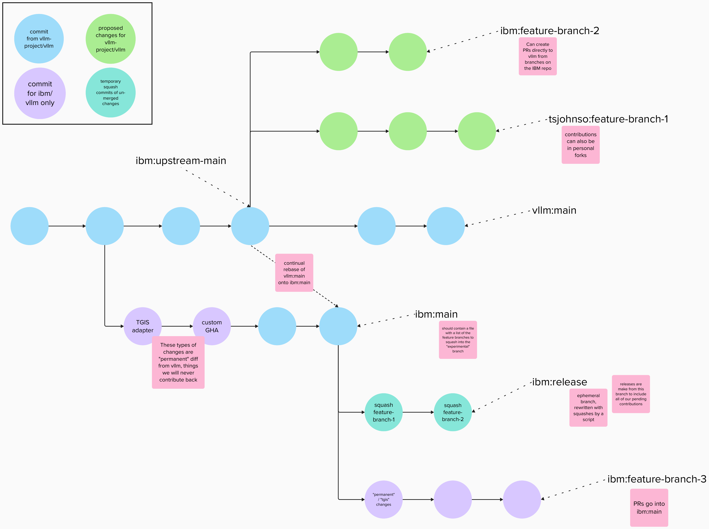

# Repo organization and building the TGIS-vLLM image

This fork attempts to remain aligned with the vLLM repo as much as possible,
while also containing a set of permanent changes to add:
- A TGIS api adapter layer (see [TGIS](https://github.com/IBM/text-generation-inference))
- A RedHat UBI-based Docker image delivery

Given the fast pace of vLLM development, we also provide builds that include yet-to-be-merged
PRs to vLLM by squash-merging open vLLM PRs onto a release branch on top of main that is continually
reconstructed as we make more contributions.

See a sketch of the commit graph


## Contributing changes for vLLM

To contribute improvements to vLLM that would have utility for the whole community, _don't_ base them on the `main` branch in this repo.
Either contribute to your own fork of vLLM, or create a branch in this repo at the latest `vllm-project/vllm:main` commit.

Open all PRs into [vLLM](https://github.com/vllm-project/vllm)

Once you have opened a PR, follow the steps for [Reconstructing the release branch](#release-branch-building-procedure)

## Contributing changes specific to the TGIS adapter or IBM delivery

Contributing changes to the TGIS adapter or IBM delivery process is business as usual, 
make changes on a branch or fork directly from this repo's `main` branch and PR it back in.

NB: When there are pending PRs to vLLM that are squashed onto the `release` branch, you will likely want to also apply your
changes on a branch off of the latest `release.xxx` tag to build and test.

Most of the IBM-specific changes in this repo are located in these files/packages:
- `vllm/tgis_utils` contains many custom implementations of classes required for feature parity with TGIS
- `vllm/entrypoints/openai/api_server.py` contains changes to parse TGIS specific command line args
- `vllm/entrypoints/openai/cli_args.py` contains changes to inject TGIS specific command line args
- `vllm/entrypoints/grpc` is entirely our own package for implementing a grpc server with the TGIS api
- `proto` contains the TGIS api defs
- `Dockerfile.ubi` is the UBI-based dockerfile that we build and ship
- `.github/workflows/build.yml` contains our workflow for building and pushing the UBI-based image

## Main branch rebasing procedure

Rebasing vllm:main onto ibm:main is pretty straightforward. Assuming you have vllm-project/vllm as the
`upstream` remote and ibm/vllm as the `origin` remote, one way to do this is:
```shell
# fetch latest ibm main
git fetch origin main

# fetch latest vllm main
git fetch upstream main
git checkout upstream/main

# point a branch here
git branch -f upstream-main-sync HEAD
git checkout upstream-main-sync

# rebase the branch onto ibm main
git rebase origin/main
# You may see _many_ warnings about skipping previously applied commits- this is expected

# Push to origin/main
git push origin HEAD:main
```

## Release branch building procedure

To rebuild the release branch, we want to squash each pending vLLM PR into a commit on top of main.

Assuming this repo is the `origin` remote and vllm-project/vllm is `upstream`, this looks something like:
```shell
# Fetch latest mains
git fetch upstream main
git fetch origin main
git checkout origin/main

# Start a new release branch here at ibm:main
git branch -f release HEAD
git checkout release

# for each ${PR_NUMBER} to squash in:
# We first fetch the PR head from vLLM
git branch -D ${PR_NUMBER}
git fetch upstream pull/${PR_NUMBER}/head:${PR_NUMBER}
# Then we want to squash-merge on top of vLLM:main
git checkout upstream/main
git merge --squash ${PR_NUMBER}
# (Resolve any conflicts here)
git commit -m "Squash ${PR_NUMBER}"
# Then we want to apply that squash commit with only that PR's changes to `release`
export SQUASH_HEAD=$(git rev-parse --short HEAD)
git checkout release
git cherry-pick $SQUASH_HEAD
# Merge conflicts should be minimal if all PRs are in a mergeable state with vllm:main
# But pending PRs may create conflicting changes with each other 

# force-push: we're overwriting the `release` branch
git push -f origin HEAD:release

# Create a tag to save this build
git tag release.$(git rev-parse --short HEAD)
git push origin release.$(git rev-parse --short HEAD)
```
